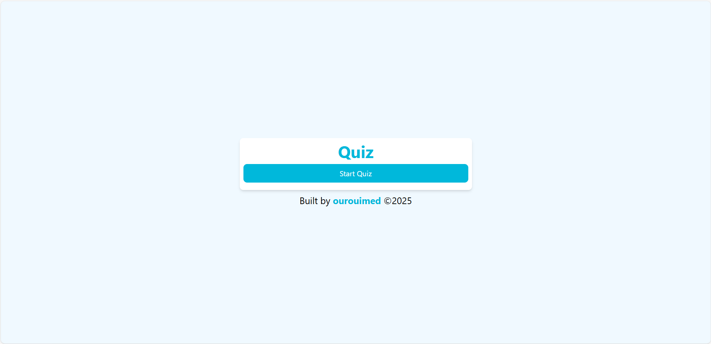
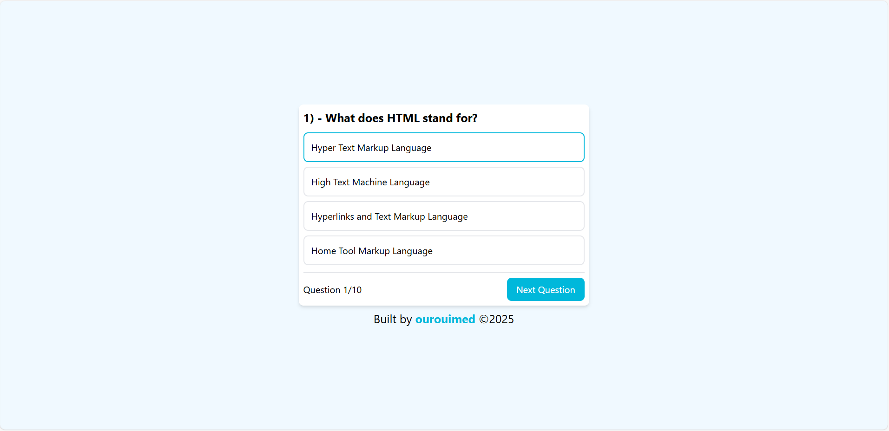
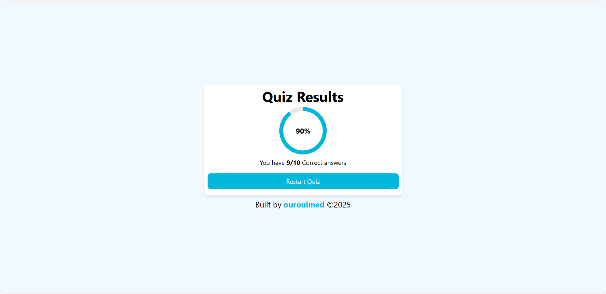

# Quiz App
A modern  quiz application built with **React** and **Vite**. The app allows users to test their knowledge with interactive quizzes.

## Features

- **Dynamic Quizzes**: Load quizzes dynamically from `question.js` file.
- **Responsive Design**: on desktops, tablets, and mobile devices.
- **Score Tracking**: Displays scores and progress at the end of quiz.
- **Fast and Optimized**: Built with Vite for faster builds and performance.

## Demo & Screenshots



Check out the live demo [here](https://ourouimed.github.io/react-quiz).

## Tech Stack

- **Frontend**: React, Vite
- **Styling**: Tailwind CSS 
- **State Management**: React hooks useState

## Installation

To run this project locally:

1. **Clone the repository**:
   ```bash
   git clone https://github.com/ourouimed/react-quiz.git
   cd react-quiz
   ```

2. **Install dependencies**:
   ```bash
   npm install
   ```

3. **Start the development server**:
   ```bash
   npm run dev
   ```

4. Open your browser and visit: `http://localhost:5173`

## File Structure
```
quiz-app/
├── public/             # Static assets 
    └── assets /        # Project screenShots
├── src/                # Quiz data 
│   ├── App.jsx         # Main app component
│   ├── main.jsx        # React entry point
│   ├── questions.js    # Questions data
│   └── index.css       # Tailwindcss styles
├── .gitignore          # Git ignore rules
├── index.html          # Main HTML file
├── package.json        # NPM configuration
├── README.md           # Project documentation
├── vite.config.js      # Vite configuration
└── eslint.config.js    # Eslint configuration
```

## How to Add a New Quiz

1. Open the `src/questions.js` file 
2. Add your questions in the following format:

   ```js
   let questions = [
    {
        question: 'What does HTML stand for?',
        answers: [
            'Hyper Text Markup Language',
            'High Text Machine Language',
            'Hyperlinks and Text Markup Language',
            'Home Tool Markup Language'
        ],
        correctAnswer: 0
    },
    {
        question: 'Which HTML tag is used to define an internal style sheet?',
        answers: [
            '<css>',
            '<style>',
            '<script>',
            '<link>'
        ],
        correctAnswer: 1
    },...
   ]
   ```

3. Save your changes. The new quiz will load automatically.
